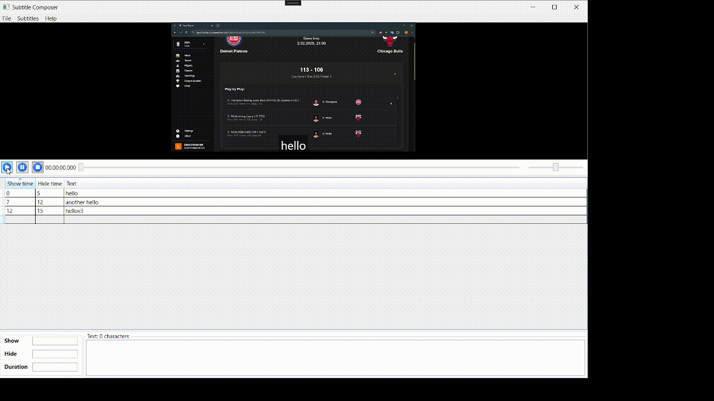

# SubtitleComposer

**SubtitleComposer** is a desktop application built with **.NET** and **WPF** for creating and editing subtitles for video files. The application provides interface for adding, editing, deleting, and synchronizing subtitles. It also supports a **plugin system**, allowing users to extend its functionality by adding custom plugins.

---

## Tech Stack
- **Framework**: .NET (C#)
- **UI**: WPF (Windows Presentation Foundation)

---
## Functionality presentation

